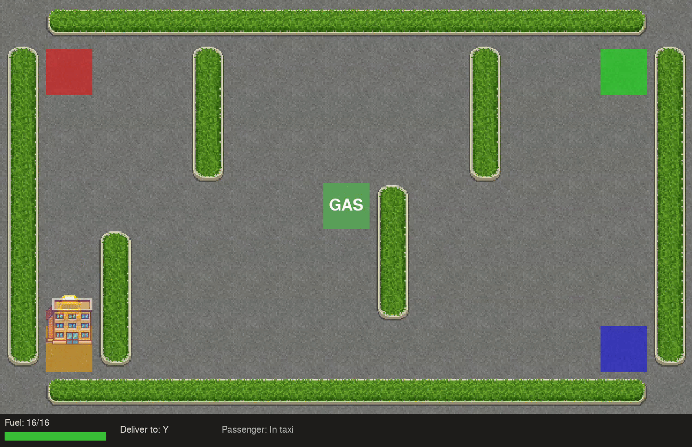

# Q-Learning — Taxi 7x7 with Fuel System

Training a taxi agent to pick up and deliver passengers on a 7x7 grid, with a fuel mechanic and gas station, using tabular Q-learning.


---

## Problem Definition

A taxi moves on a 7x7 grid. The agent must:
- Pick up a passenger at one of four fixed locations
- Deliver the passenger to one of four destinations
- Manage fuel, refueling at the gas station
- Avoid running out of fuel

| Property | Value |
|---|---|
| Grid size | 7×7 |
| Passenger locations | 4 |
| Destinations | 4 |
| Fuel tank | 16 units |
| Gas station | Center cell (3,3) |
| Actions | South, North, East, West, Pickup, Dropoff, Refuel |
| Max steps | 50 |

---

## Environment

### State Space

Each state is encoded as a unique integer, representing:
- Taxi position (row, col)
- Passenger location (4 positions + in taxi)
- Destination (4 targets)
- Fuel level (0–16)

Total states: $7 \times 7 \times 5 \times 4 \times 17 \approx 16,660$

### Action Space

Discrete, 7 actions:
- South, North, East, West, Pickup, Dropoff, Refuel

If `use_fuel=False`, Refuel is disabled (6 actions).

### Fuel System

- Fuel decreases by 1 each step (except refuel)
- If fuel reaches zero, episode ends
- Refuel action restores fuel at gas station

---

## Q-Learning Algorithm

Tabular Q-learning stores values in a Q-table:

$$Q(s, a)$$

- Rows: all possible states
- Columns: all possible actions

Update rule:

$$
Q(s, a) \leftarrow Q(s, a) + \alpha [r + \gamma \max_{a'} Q(s', a') - Q(s, a)]
$$

- $\alpha$: learning rate
- $\gamma$: discount factor
- $r$: reward
- $s'$: next state

Exploration is managed by $\epsilon$-greedy policy:
- With probability $\epsilon$, choose random action
- Otherwise, choose action with highest Q-value

---

## Development History

### Initial Environment

- Started with Gymnasium Taxi (5×5 grid, 4 passenger locations, 4 destinations)
- State space: $5 \times 5 \times 5 \times 4 = 500$

### Environment Extension

- Expanded to 7×7 grid
- Added gas station and fuel system
- Manual playable version created for testing mechanics

### Fuel Mechanic

- Fuel decreases each step
- Refuel action added
- Episode ends if fuel runs out
- Experimented with tank sizes:
  - 30 units: task too easy
  - 20 units: agent could reach any point without refueling
  - 15 units: some configurations impossible

### Training and Results

- Q-learning agent trained on extended environment
- Visualizations added (Pygame, reward plots)
- Policy evaluated with and without fuel mechanic

---


## Demo

### Environment **with fuel/gas system**
- The agent achieves **~88% success rate** after ~200,000 episodes.

<p align="center">
  
  
</p>

---

### Environment **without fuel/gas system**
- The agent achieves **~100% success rate** after ~150,000 episodes.

<p align="center">
  
  
</p>

---

## Project Structure

```
├── main.py                  # Entry point: argparse, config, GUI
├── requirements.txt
├── README.md
├── LICENSE
├── assets/                  # Demo GIFs
├── taxi/
│   ├── __init__.py
│   ├── agent.py             # QAgent: Q-table, learning, action selection
│   ├── config.py            # Dataclass configs, Action Enum
│   ├── env.py               # TaxiEnv: grid, fuel, step logic
│   ├── gui.py               # Pygame GUI
│   ├── runner.py            # Training/testing loop
│   └── img/                 # Sprites
└── policy/
    └── q_table.npy          # Saved Q-table
```

---

## Hyperparameters

| Parameter | Value |
|---|---|
| Learning rate ($\alpha$) | 0.1 |
| Discount ($\gamma$) | 0.95 |
| Epsilon start | 1.0 |
| Epsilon decay | 0.99997 |
| Epsilon min | 0.01 |
| Max steps | 50 |
| Fuel tank | 16 |
| Training episodes | 300,000 |
| Save every | 50,000 |
| Progress every | 1,000 |

---

## Reproducibility

### Install

```bash
pip install -r requirements.txt
```

### Train

```bash
python main.py --train
```

### Test

```bash
python main.py --test
```

### Additional Options

```
--model-path PATH      Path to .npy Q-table file (default: policy/q_table.npy)
--no-fuel             Disable fuel mechanic
--no-sim              Headless mode (no GUI)
--episodes N          Number of training episodes
```

### Output

- **Live GUI**: taxi grid, passenger, destination, fuel, reward plot
- **Saved Q-table**: `policy/q_table.npy`
- **Metrics displayed**: total reward, success rate

---

## Metrics

| Metric | Description |
|---|---|
| Total reward | Sum of rewards for the episode |
| Success rate | Sliding-window average of successful deliveries |
| Steps / episode | Number of steps taken before termination |
| Fuel used | Units of fuel consumed |

---

## License

MIT License
