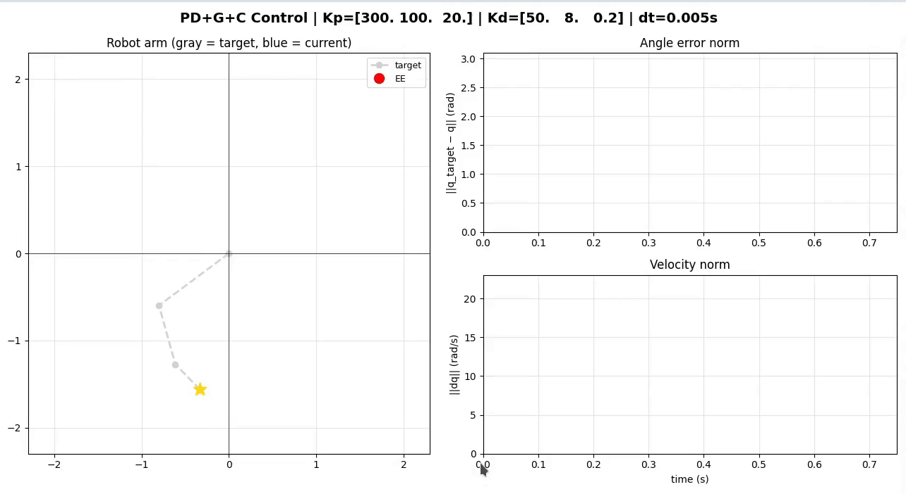
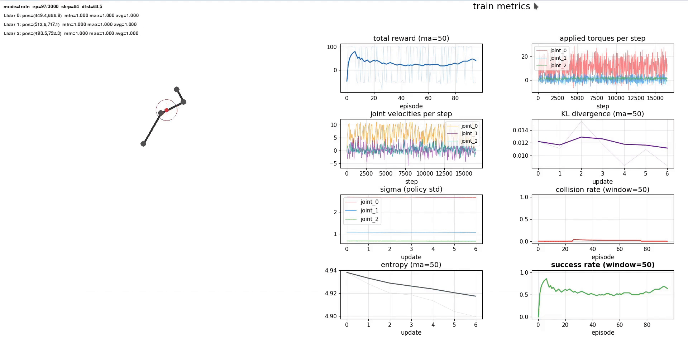
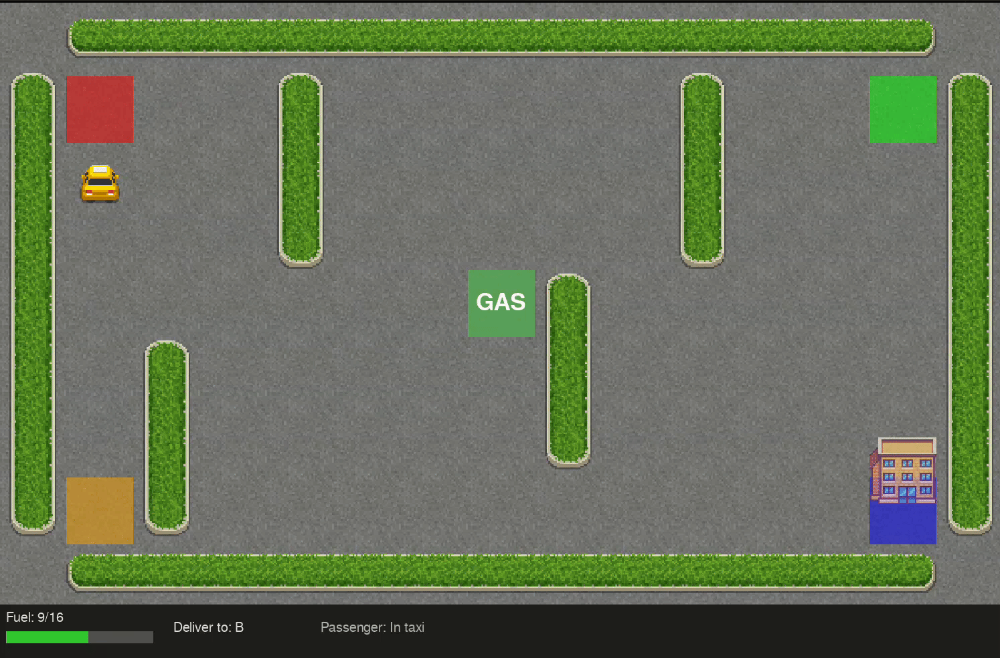

# Actor-Critic PPO - 3-DOF Planar Manipulator with Dynamic Obstacle Avoidance

Training a three-link planar manipulator with LIDAR-like perception using Actor-Critic PPO + TD + GAE, with curriculum from static tasks to dynamic targets/obstacles and full torque-level control.


---

## Problem Definition

A three-link (3-DOF) planar manipulator is mounted on a fixed base.
The policy controls joint torques and must move the end-effector to a target while avoiding circular obstacles that can move over time.

Project workflow (per report): training started from simpler static setups and then moved to dynamic scenarios (moving targets/obstacles) to improve generalization.

| Property | Value |
|---|---|
| Link lengths | L1 = 90, L2 = 70, L3 = 40 (px) |
| Action constraint | $\tau \in [-\tau_{\max}, +\tau_{\max}]$, $\tau_{\max} = (12, 8, 8)$ |
| Goal condition | End-effector within 30 px of target |
| Max episode length | 600 steps |
| Obstacles (default) | 2 circles, radius 30 px |
| Obstacle dynamics | Elliptic motion + per-episode jitter |

The environment is deterministic given current state and action. Randomness is introduced by episode reset: obstacle jitter/phase, and optional randomization of target and initial joint angles.

---

## Environment

### State Space

The observation depends on `EnvConfig.obs_mode`:

- `base`: 13 dims
- `static`: 41 dims (with 2 obstacles)
- `dynamic`: 45 dims (default, with 2 obstacles)

Base features:

- $\sin(\theta_i), \cos(\theta_i)$ for 3 joints → 6
- End-effector position $(x_{ee}, y_{ee})$ normalized by reach → 2
- Relative target vector $(\Delta x, \Delta y)$ normalized by reach → 2
- Joint velocities $\dot{q}/15$ → 3

Additional features:

- LIDAR rays: `n_lidars * num_rays = 3 * 8 = 24`
- Obstacle relative positions (per obstacle): 2
- Obstacle velocities (only in `dynamic` mode, per obstacle): 2

### LIDAR Perception

LIDAR sensors are attached to all joints:

- 8 rays per sensor, uniformly over $[0, 2\pi)$
- Maximum ray length: 50 px
- Reading is normalized to $[0, 1]$
- 1.0 means no hit, lower values indicate proximity to obstacle

### Action Space

Continuous 3D torque vector:

$$a_t = (\tau_1, \tau_2, \tau_3)$$

Actions are sampled from a diagonal Gaussian policy in training mode and clipped by torque limits in the robot dynamics step.

### Obstacles

Obstacle manager supports randomization and motion:

- Per episode: each obstacle origin is jittered in a disk (`jitter_radius = 30`)
- During episode: each obstacle moves on an ellipse:
  - $x = x_0 + a \cos(\omega t + \phi)$
  - $y = y_0 + b \sin(\omega t + \phi)$

Default parameters:

| Parameter | Value |
|---|---|
| Number of obstacles | 2 |
| Radius | 30 px |
| Jitter radius | 30 px |
| Dynamic motion | enabled |
| Ellipse semi-axes | a = 80, b = 60 |
| Angular frequency | $\omega = 0.1$ |

### Termination Conditions

| Condition | Type | Reward signal |
|---|---|---|
| End-effector within `target_thresh` | Success | `+goal_reward` |
| Collision with obstacle | Failure | `-collision_penalty`, `-fail_penalty` |
| Stagnation window criterion | Failure | `-fail_penalty` |
| Step count reaches `max_steps` | Timeout | `-fail_penalty` |

### Reward Function

Reward is composed of:

- progress term (distance reduction)
- step penalty
- torque penalty
- velocity penalty near danger zone
- obstacle danger penalty from LIDAR
- terminal bonuses/penalties

Config defaults (`RewardConfig`):

| Component | Parameter | Default |
|---|---|---|
| Progress scale | `progress_scale` | 0.9 |
| Near-goal boost | `progress_near_boost` | 0.2 |
| Boost radius | `progress_boost_radius` | 60.0 |
| Step penalty | `step_penalty` | 0.08 |
| Velocity penalty | `vel_penalty` | 0.08 |
| Torque penalty | `torque_penalty` | 0.05 |
| Obstacle danger threshold | `obstacle_danger_threshold` | 0.7 |
| Obstacle danger penalty | `obstacle_danger_penalty` | 2 |
| Collision penalty | `collision_penalty` | 60.0 |
| Goal reward | `goal_reward` | 80.0 |
| Fail/timeout penalty | `fail_penalty` | 40.0 |

## Physics and Torque Control

### Dynamic Model

The manipulator is simulated as a 3-DOF rigid-body system with:

- inertia matrix $M(q)$
- Coriolis/centrifugal terms $C(q,\dot{q})\dot{q}$
- gravity vector $G(q)$

The joint dynamics are modeled as:

$$M(q)\ddot{q} + C(q,\dot{q})\dot{q} + d\dot{q} + G(q) = \tau$$

where $d\dot{q}$ is viscous damping and $\tau$ is the applied joint torque.

### Why Gravity Compensation Is Kept

Gravity compensation is retained to avoid spending most of the learning capacity on static gravity balancing.
This keeps the task focused on planning and obstacle-aware reaching under realistic dynamics.

---

## PPO Algorithm

Current training uses Actor-Critic PPO (`ppo/model_actor_critic_ppo.py`):

- Shared MLP backbone (`256 -> 128`, ReLU)
- Actor head: Gaussian mean ($\tanh$-bounded by torque limits) + learnable $\log\sigma$
- Critic head: scalar value estimate $V(s)$
- On-policy buffer with batch updates
- PPO clipped objective + value loss + entropy regularization
- GAE ($\lambda = 0.95$) for advantage estimation
- KL-based early stop for PPO epochs
- TD targets for critic: $r_t + \gamma V(s_{t+1})(1 - d_t)$

### Policy / Critic Parameterization

For state embedding $z = f_\theta(s)$:

- $\mu(s) = \tanh(W_\mu z + b_\mu) \cdot \tau_{\max}$
- $V(s) = W_v z + b_v$
- $\log\sigma = \text{clamp}(\log\sigma,\ \log\sigma_{\min},\ \log\sigma_{\max})$
- $\sigma = \exp(\log\sigma) \cdot \tau_{\max}$

Policy distribution:

- $\pi_\theta(a|s) = \mathcal{N}(\mu(s), \sigma)$
- $\log\pi_\theta(a_t|s_t) = \sum_i \log\mathcal{N}(a_{t,i};\, \mu_i, \sigma_i)$

### TD Targets and GAE

$$\hat{V}_t = r_t + \gamma V(s_{t+1})(1 - d_t)$$

$$\delta_t = r_t + \gamma V(s_{t+1})(1 - d_t) - V(s_t)$$

$$A_t = \delta_t + \gamma\lambda(1 - d_t)\,A_{t+1}$$

$$A_t \leftarrow \frac{A_t - \bar{A}}{\text{std}(A) + \varepsilon}$$

### PPO Objectives

Likelihood ratio:

$$\rho_t(\theta) = \exp\!\bigl(\log\pi_\theta(a_t|s_t) - \log\pi_{\text{old}}(a_t|s_t)\bigr)$$

Clipped surrogate for actor:

$$L^{\text{clip}} = \mathbb{E}_{T\sim \mathrm{Uniform}[0, T_b - 1]}\bigl[\min\bigl(\rho_t A_t,\ \text{clip}(\rho_t,\,1{-}\varepsilon,\,1{+}\varepsilon)\,A_t\bigr)\bigr]$$

Critic loss (in code with normalized targets per mini-batch):

$$L^{\text{value}} = \text{MSE}\!\bigl(\hat{V}_{\text{norm}}(s_t),\ \hat{V}^{\text{target}}_{\text{norm},t}\bigr)$$

Entropy bonus:

$$H = \mathbb{E}_{T\sim \mathrm{Uniform}[0, T_b - 1]}\left[\sum_i \mathcal{H}\bigl(\mathcal{N}(\mu_i, \sigma_i)\bigr)\right]$$

Total minimized loss in code:

$$\mathcal{L} = -L^{\text{clip}} + c_v\,L^{\text{value}} - c_H\,H$$

KL control (approximation used in code):

$$D_{\text{KL}} \approx \mathbb{E}_{T\sim \mathrm{Uniform}[0, T_b - 1]}\bigl[(\rho_t - 1) - \log\rho_t\bigr]$$

If $D_{\text{KL}} > D_{\text{KL}}^{\text{target}}$, PPO epoch loop is stopped early.

### How Sigma Is Updated

Current implementation uses **global trainable $\log\sigma$** (`nn.Parameter` of size 3), not a separate sigma head per state.

- $\log\sigma$ is optimized jointly with all policy parameters by Adam during PPO backpropagation.
- It is constrained every forward pass by $\text{clamp}(\log\sigma_{\min}, \log\sigma_{\max})$.
- Effective exploration scale per joint is:
  - $\sigma_j = \exp\bigl(\text{clamp}(\log\sigma_j)\bigr) \cdot \tau_{\max,j}$
- So $\sigma$ changes only through gradient updates from PPO loss (policy term + entropy term), with no manual sigma decay schedule.

### Why Actor-Critic PPO

Compared to policy-gradient-only variants, current implementation:

1. Uses critic targets for lower-variance updates
2. Reuses trajectories via mini-batch PPO epochs
3. Constrains update size with clipping and KL monitoring
4. Optimizes exploration through entropy term

### Update Rule (implemented)

1. Collect episode trajectories (states, actions, log_probs, rewards, values)
2. Compute TD targets and GAE advantages at episode end
3. Accumulate episodes until `batch_size_limit` (default 2048 steps)
4. Normalize advantages over the batch
5. For up to `ppo_epochs`:
   - estimate KL on full batch
   - stop early if $D_{\text{KL}} > D_{\text{KL}}^{\text{target}}$
   - optimize shuffled mini-batches
6. Step cosine annealing scheduler
7. Clear batch buffer

Loss used in code:

$$\mathcal{L} = L^{\text{policy}} + c_v\,L^{\text{value}} - c_H\,H$$

---

## Development History

### Iteration 1 - Base actor-critic + MC + PPO clip

Started from a basic setup: one network outputs $\mu$, $\sigma$, and $V(s)$, actions sampled from Gaussian policy, Monte Carlo returns for advantages ($A = R - V$), PPO clipped objective with value loss and entropy.

### Iteration 2 - From pure MC to TD + GAE

Pure MC produced noisy targets and unstable learning. Replaced with TD targets for critic ($r + \gamma V(s')$) and GAE for actor advantages, then normalized advantages per batch.

### Iteration 3 - Understanding PPO role and KL early stopping tuning

Kept PPO clip as protection from destructive policy jumps and added KL-based early stopping. Initial KL threshold was too strict, so updates often ended after the first epoch.

### Iteration 4 - From pure kinematics to manipulator dynamics

Moved from simplified setup to realistic 3-link dynamics with inertia matrix, Coriolis terms, and gravity vector.
<p align="center">
  
</p>

### Iteration 5 - External PD stage and transition to pure torque control

Used an external PD stage temporarily (policy produced target angles, PD converted them to torques). After review, removed PD from control loop to keep pure RL torque control.
<p align="center">
  
</p>

### Iteration 6 - Gravity compensation and final loss form

Added gravity compensation term to applied torques to avoid wasting learning capacity on static gravity balancing. Training stabilized. Settled on:

$$\mathcal{L} = L^{\text{policy}} + c_v\,L^{\text{value}} - c_H\,H$$

### Iteration 7 - Non-learning sigma and failed fixes

Observed $\sigma$ not adapting properly. Tried global sigma vector and manual sigma decay; manual decay caused KL explosions and aggressive early stopping.
<p align="center">
  
</p>

### Iteration 8 - KL diagnostics and loss-scale analysis

Added deeper diagnostics: KL, $L^{\text{policy}}$, $L^{\text{value}}$, and entropy tracking. Found strong scale imbalance where $L^{\text{value}}$ dominated updates.

### Iteration 9 - Value normalization and sigma recovery

Normalized/scaled value targets and tuned value-loss influence. After balancing losses, $\sigma$ started decreasing naturally and KL behavior became more stable.

### Iteration 10 - Curriculum: static-target stage

Introduced a fixed-target setup with up to 600 steps/episode. Agent reached near-100% success in this static scenario.

### Iteration 11 - Overfitting to one configuration

Transferred static-stage weights poorly to random targets. Policy overfit to one geometry and did not generalize.

### Iteration 12 - Transition to moving targets and obstacles

Expanded state with obstacle positions and velocities. Switched to training directly in dynamic scenarios instead of long static pretraining.
<p align="center">
  
</p>

### Iteration 13 - Working behavior in dynamic scenes

This version became the practical one: harder training but meaningful behavior in non-stationary scenes, with obstacle-aware motion and consistent target reaching.
<p align="center">
  
</p>


---

## Project Structure

```
|-- main.py
|-- requirements.txt
|-- README.md
|-- LICENSE
|-- assets/
|-- policy/
|   |-- best_policy.pt
|   |-- best_policy_const.pt
|   `-- policy_reinforce.pt
`-- ppo/
    |-- __init__.py
    |-- config.py
    |-- state.py
    |-- robot.py
    |-- physics_robot.py
    |-- lidar.py
    |-- obstacle.py
    |-- env.py
    |-- runner.py
    |-- gui.py
    |-- fast_math.py
    |-- model_actor_critic_ppo.py
    |-- model_ppo.py
    `-- model_reinforce.py
```

`main.py` currently builds and runs `model_actor_critic_ppo.py`.

---

## Hyperparameters

From `ModelConfig`, `EnvConfig`, and `GUIConfig` defaults:

| Parameter | Value |
|---|---|
| Hidden layers | 256 -> 128 (ReLU) |
| Discount $\gamma$ | 0.97 |
| GAE $\lambda$ | 0.95 |
| Learning rate | 3e-4 -> 1e-6 (cosine annealing) |
| Clip coefficient $\varepsilon$ | 0.2 |
| PPO epochs per update | 10 |
| Mini-batch size | 512 |
| Batch size limit | 2048 steps |
| Target KL | 0.15 |
| Entropy coefficient $c_H$ | 0.002 |
| Value loss coefficient $c_v$ | 0.1 |
| Gradient clip norm | 1.0 |
| $\log\sigma$ range | [-3.0, -0.7] |
| Max episode steps | 600 |
| Training episodes | 3000 |
| Test episodes | 500 |

Values referenced in project report (`text.txt`) for algorithm discussion:

- $\gamma = 0.99$
- $\lambda = 0.95$
- clip $\varepsilon = 0.2$
- $c_H = 0.01$
- PPO epochs = 10
- batch buffer = 2048
- mini-batch = 256

---

## Reproducibility (implemented using python3.12)

### Install

```bash
pip install -r requirements.txt
```

### Train

```bash
python main.py --train
```

Headless training (without pygame sim window):

```bash
python main.py --train --no-sim
```

Optional curriculum/randomization flags:

```bash
python main.py --train --randomize-target --randomize-theta
```

Optional finetuning from checkpoint:

```bash
python main.py --train --finetune policy/best_policy_const.pt
```

### Test

```bash
python main.py --test
```

### Additional Options

```
--model-path PATH
--train-episodes N
--test-episodes N
--seed N
--no-sim
--finetune WEIGHTS_PATH
--randomize-target
--randomize-theta
```

### Output

- Live simulation + metrics (pygame mode)
- Live matplotlib metrics (headless mode)
- Saved model checkpoint (default: `policy/best_policy.pt`)

---

## Collected Metrics

Training plots include:

- Total reward
- Applied torques per joint
- Value loss
- KL divergence
- $\sigma$ per joint
- Collision rate
- Entropy
- Success rate

Test plots include:

- Cumulative success rate
- Cumulative collision rate
- Angle error trace (if available in metrics)
